# ACMRecruitmant-S2
# Progress 
## week 1:
###  Started Strivers A2Z sheet (Array - easy)
### 1. Finished "Largest element in an array"
### 2. Finished " Finding the second largest term in an array"


### 3.Finished "Check if an Array is Sorted"

### 4.Finished "Remove Duplicates in-place from Sorted Array"
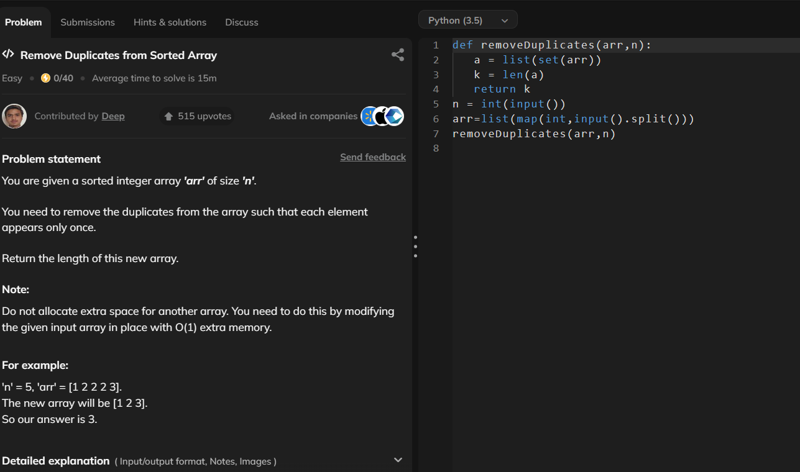
### 5.Finished "rotate an array by one"
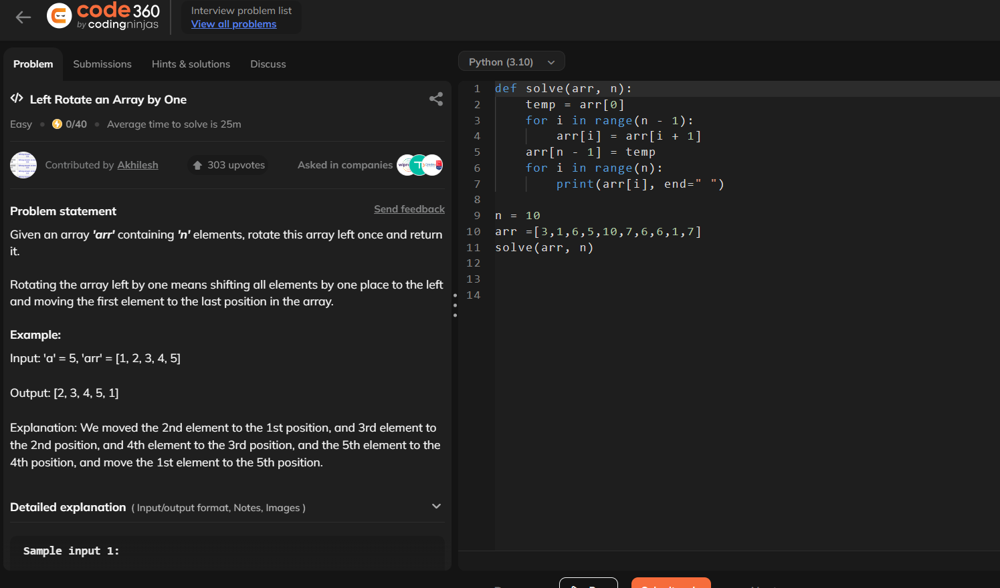
### 6.Finished "rotate an array by n terms'
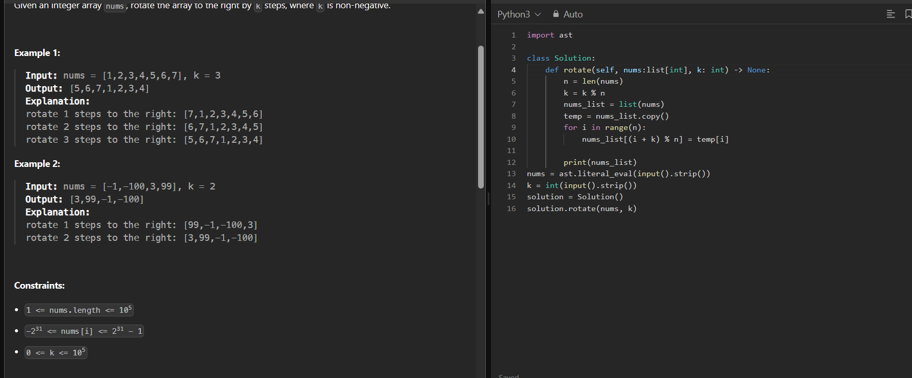
## started revising the theory topics 
## finished topics:
### 1. like handling outliers
### i. z- score method
### ii .interquartile range
### iii. capping and clipping
### 7.Finished "move zeroes to end"

### 8. finished "Linear search"
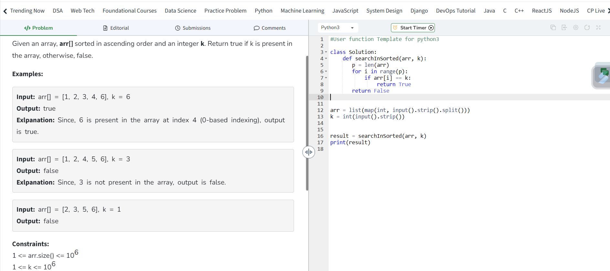
### 9. Finished "union of arrays"
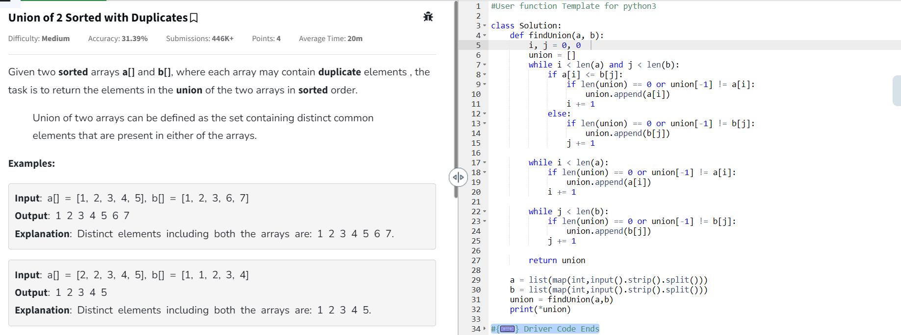
### 10. Finished " finding the missing term"
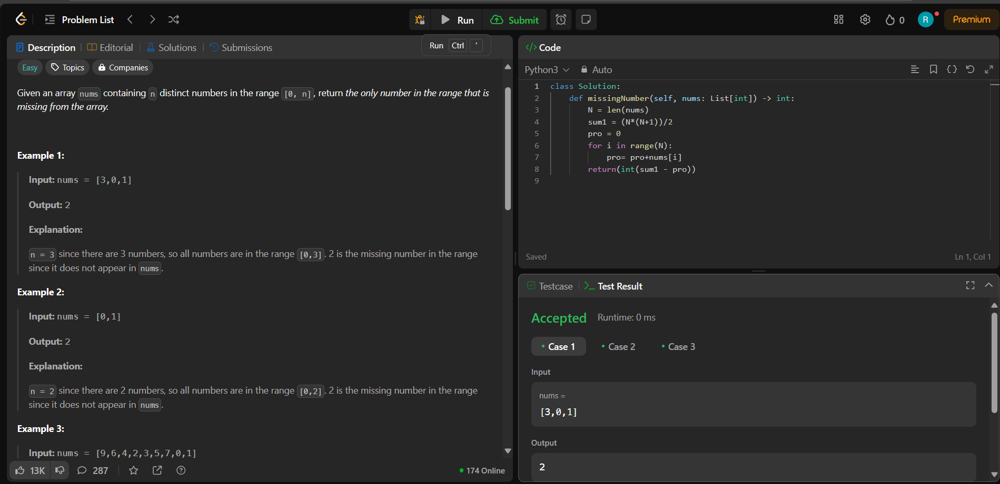
### 11. Finished " finding the max conseutive ones"
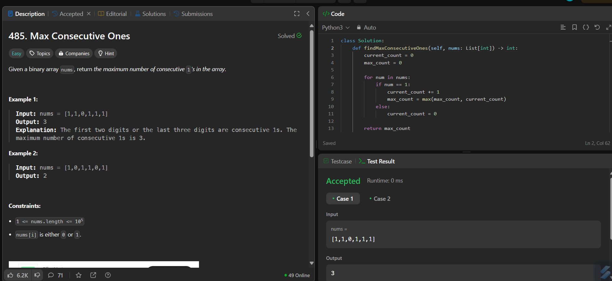
### 12. Finished "find the number that appears once"
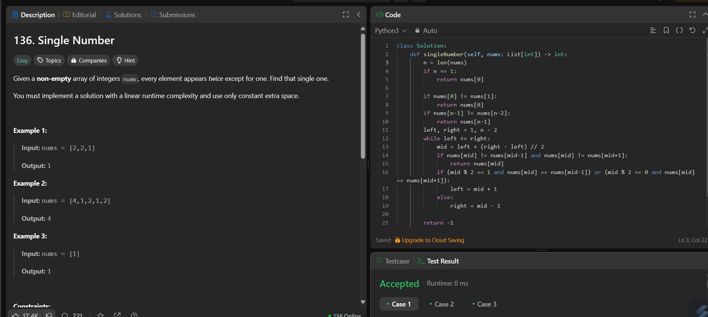
### 13.Finished "Longest Subarray with given Sum K"
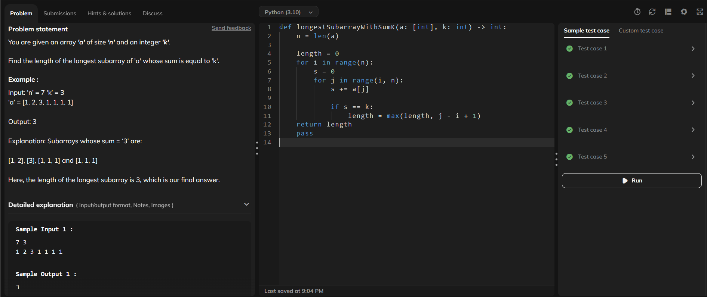
### 14.Finished "Longest_Subarray_with_sum_K _[Postives_and_Negatives]"
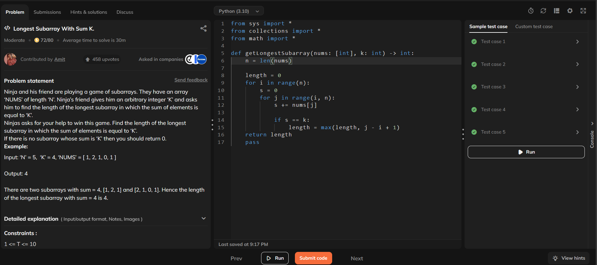

## week 2
### Started Strivers A2Z sheet (Array - Medium)
### 1.Finished " Two Sum Problem"
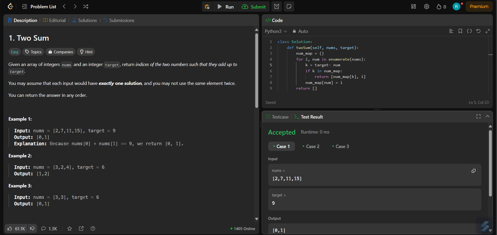
### 2.Finished "Sort an array of 0's 1's and 2's"
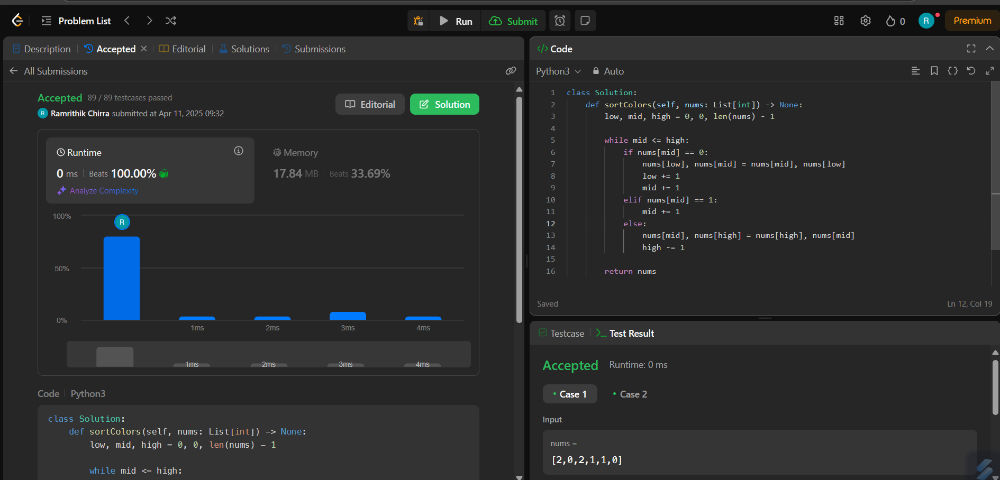
### 3.Finished "Majority_Element"
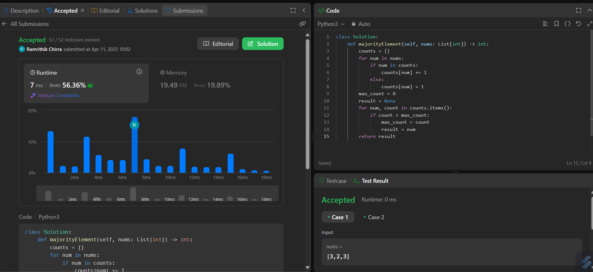
### 4.Finished "Kadane's Algorithm, maximum subarray sum"
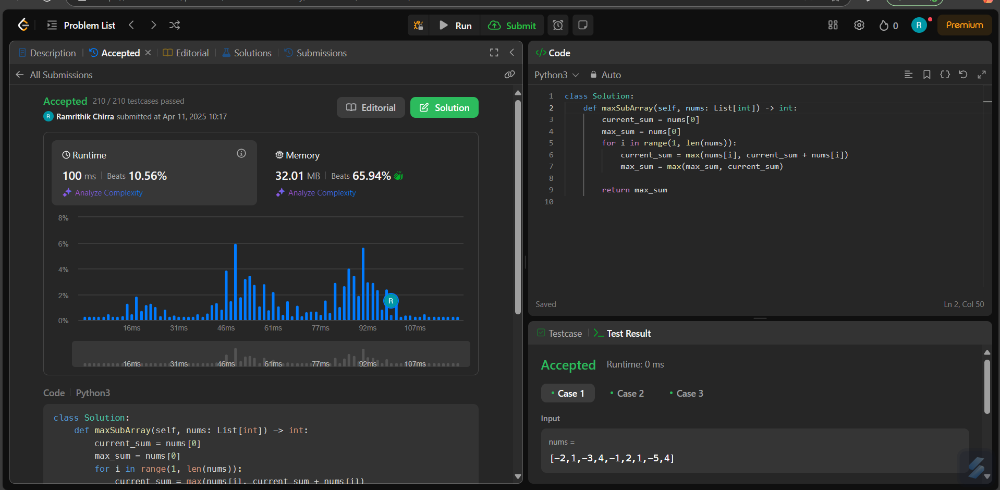
### 6.Finished "Stock_Buy_and_Sell"
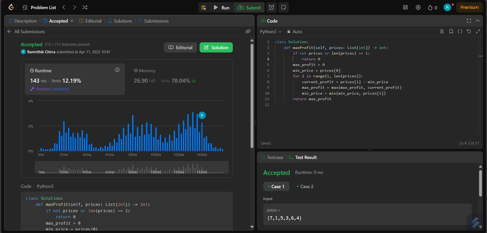
## ML assignment 
### completed Video Tutorials:

#### • StatQuest with Josh Starmer Linear Regression

#### • Codebasics – Gradient Descent Explained
### completed coding
### • Linear Regression from Scratch (Python) - GeeksforGeeks
#### code 
.png)
.png)
#### output
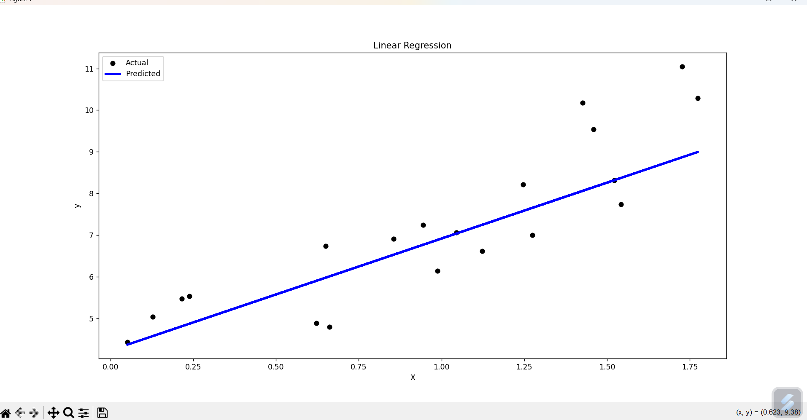
### •  Implementing Gradient Descent in Python
#### code
.png)
.png)
#### output
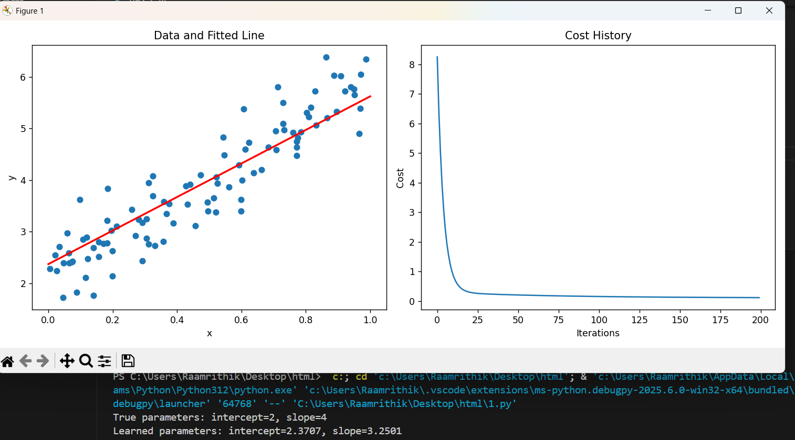
### started k-means algorithm 
#### code
.png)
.png)
#### output
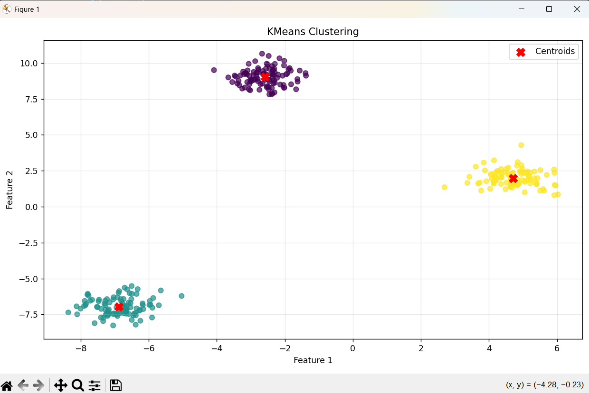
# Machine Learning Mini Projects
 Week 2 Implementation Task:
- [Titanic Survival Prediction (Supervised Learning)](#titanic-survival-prediction-supervised-learning)
- [Customer Segmentation (Unsupervised Learning)](#customer-segmentation-unsupervised-learning)

## Titanic Survival Prediction (Supervised Learning)

### Problem Statement
Predict whether a passenger survived the Titanic shipwreck based on features such as age, gender, and class.

###  Dataset
- Source: [Titanic Dataset on GitHub](https://raw.githubusercontent.com/datasciencedojo/datasets/master/titanic.csv)

###  Technologies Used
- Python
- Pandas, NumPy
- Scikit-learn
- Matplotlib, Seaborn

###  Workflow
1. **Data Cleaning**:  
   - Filled missing values for Age and Embarked.
   - Dropped irrelevant columns like Cabin, Ticket, Name, and PassengerId.
2. **Encoding**:  
   - Label Encoding for Sex and Embarked.
3. **EDA**:  
   - Visualized survival distribution across genders.
4. **Model Building**:  
   - Decision Tree Classifier
   - Random Forest Classifier
5. **Evaluation**:  
   - Accuracy Score
   - Confusion Matrix

###  Results
- Random Forest outperformed Decision Tree.
- Model accuracy > 80%.

## Customer Segmentation (Unsupervised Learning)

###  Problem Statement
Group mall customers into clusters based on their annual income and spending score.

###  Dataset
- Source: [Mall Customer Segmentation Dataset](task_implementation/customer_segmentation.csv)

### Technologies Used
- Python
- Pandas
- Scikit-learn
- Matplotlib

###  Workflow
1. **Data Preprocessing**:  
   - Selected Annual Income (k$) and Spending Score (1-100) for clustering.
2. **EDA**:  
   - Scatter plot for initial distribution.
3. **Model Building**:  
   - K-Means Clustering
   - Optimal clusters determined using Elbow Method (k=5).
4. **Evaluation**:  
   - Silhouette Score calculated.

###  Results
- Five distinct customer groups identified.
- Visualized customer segments clearly.

##  How to Run

```bash
pip install pandas numpy matplotlib seaborn scikit-learn
python titanic_survival_prediction.py
python customer_segmentation.py

