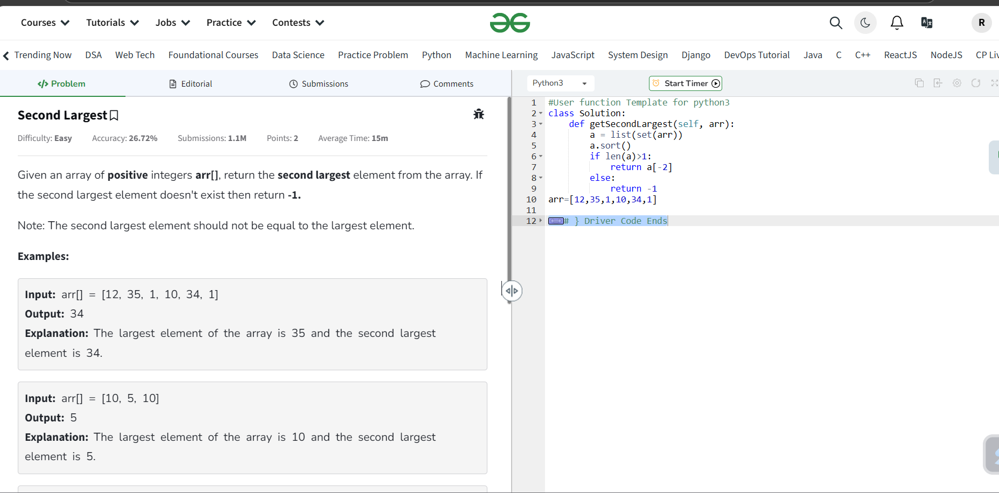
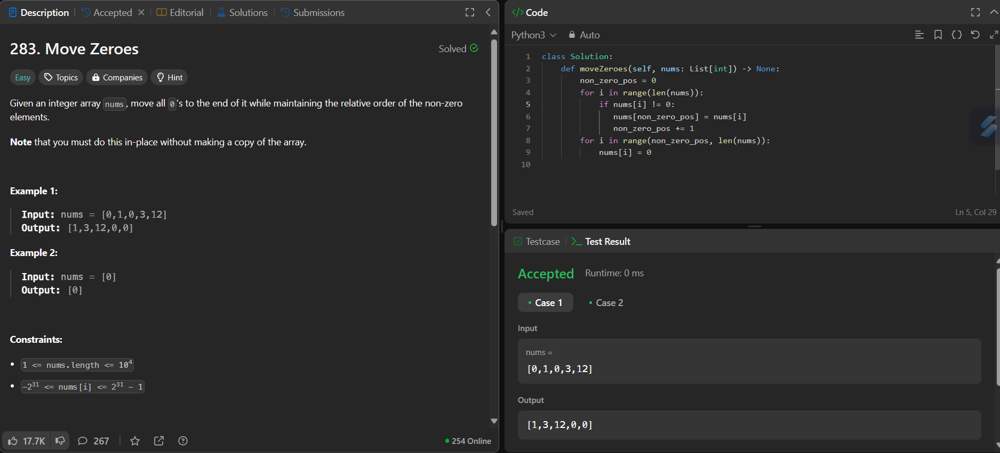

# ACMRecruitmant-S2
# Progress 
## week 1:
###  Started Strivers A2Z sheet (Array - easy)
### 1. Finished "Largest element in an array"
### 2. Finished " Finding the second largest term in an array"

### 3.Finished "Check if an Array is Sorted"

### 4.Finished "Remove Duplicates in-place from Sorted Array"

### 5.Finished "rotate an array by one"

### 6.Finished "rotate an array by n terms'

## started revising the theory topics 
## finished topics:
### 1. like handling outliers
### i. z- score method
### ii .interquartile range
### iii. capping and clipping
### 7.Finished "move zeroes to end"

### 8. finished "Linear search"

### 9. Finished "union of arrays"

### 10. Finished " finding the missing term"

### 11. Finished " finding the max conseutive ones"

### 12. Finished "find the number that appears once"

### 13.Finished "Longest Subarray with given Sum K"

### 14.Finished "Longest_Subarray_with_sum_K _[Postives_and_Negatives]"

## week 2
### Started Strivers A2Z sheet (Array - Medium)
### 1.Finished " Two Sum Problem"

