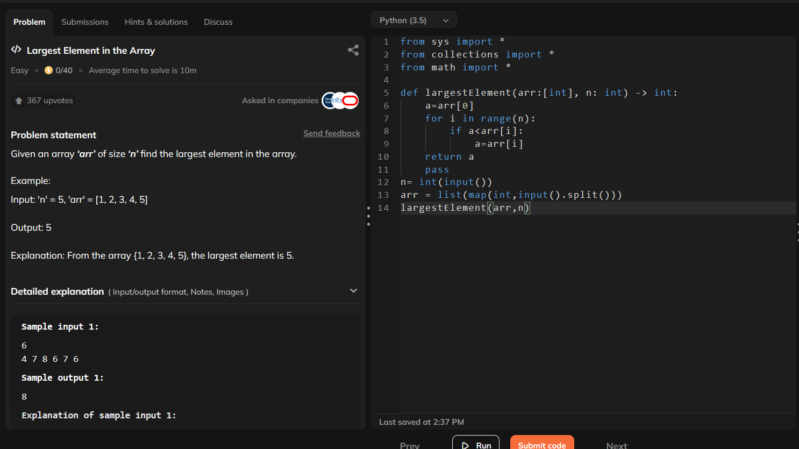
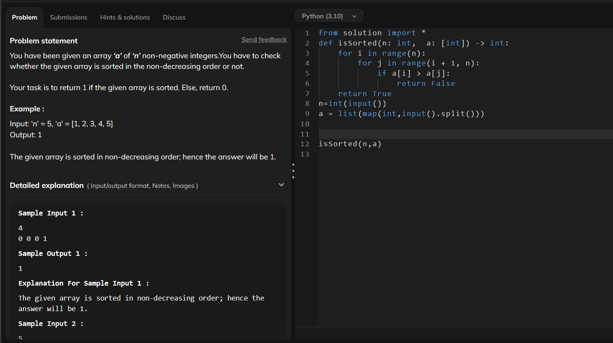

# ACMRecruitmant-S2
# Progress 
## week 1:
###  Started Strivers A2Z sheet (Array - easy)
### Finished "Largest element in an array"
### Finished " Finding the second largest term in an array"

### Finished "Check if an Array is Sorted"

### Finished "Remove Duplicates in-place from Sorted Array"

### Finished "rotate an array by one"

### Finished "rotate an array by n terms'

## started revising the theory topics 
## finished topics:
### 1. like handling outliers
### i. z- score method
### ii .interquartile range
### iii. capping and clipping
